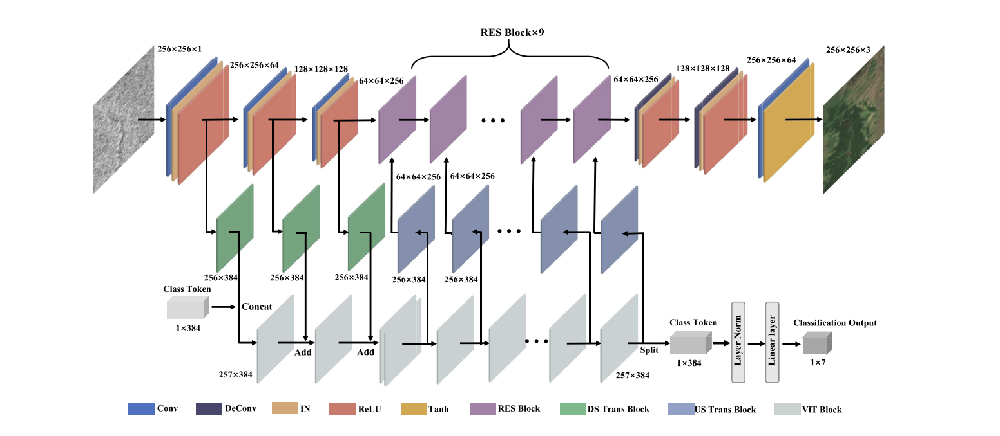
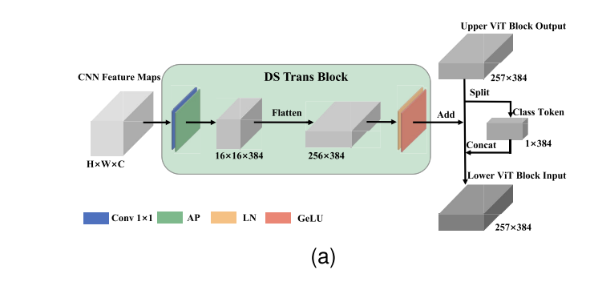
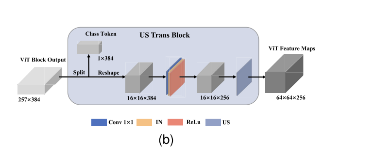
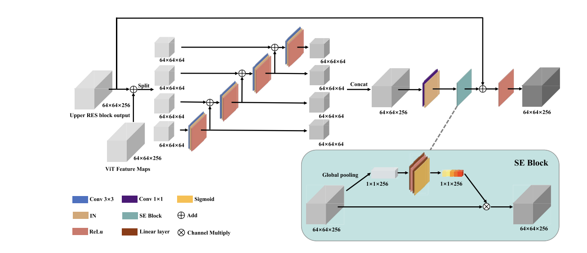
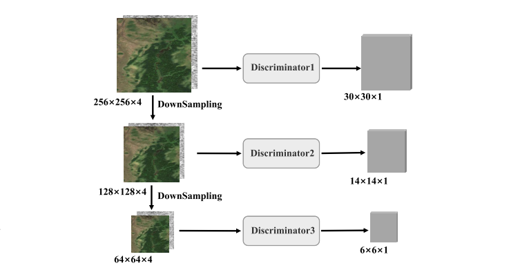
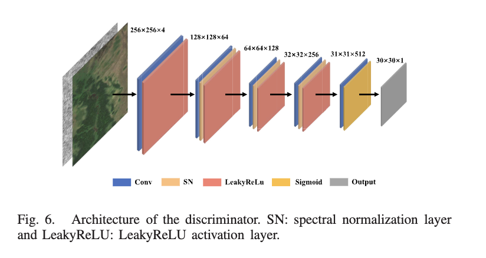

# SAR to EO Image Translation

This project aims to translate a Sentinel 1 SAR (VV) patch into the matching Sentinel 2 optical (RGB) image. The task
is ill posed: SAR carries no colour or spectral information, so a single SAR input is consistent with
many plausible optical outputs. The model is therefore ranked on perceptual metrics (LPIPS and FID),
with pixel metrics (SSIM and PSNR) reported as secondary diagnostics. A private held out set of
unseen geographies independently tests generalisation.

The core idea I worked with throughout is that **SAR carries structure, not colour**. In my data
exploration the correlation between SAR brightness and optical brightness was about −0.04, essentially
zero. So the model can recover edges, boundaries, rivers and field structure from the SAR, but it has
to infer colour and tone from learned priors. Almost every design decision below follows from that.

---

## Approach

I built a **Hybrid Conditional GAN** that couples a CNN branch (local texture) with a Transformer
branch (global context) and fuses them, judged by a multi scale spectral norm PatchGAN. It is trained
with adversarial, L1, VGG perceptual and terrain classification losses. This follows the Hybrid cGAN
design (Coupling Global and Local Features for SAR to Optical Image Translation).

I treated the version with a standard global attention ViT branch as my baseline, then ran two
controlled experiments against it. Experiment A swaps the global attention for windowed Swin
attention. Experiment B halves the L1 loss weight from 80 to 40. All three were trained on the same
data with the same settings, so the comparisons are clean. Training ran on Modal cloud GPUs (final
runs on an NVIDIA H100) and every run was tracked in Weights and Biases.

---

## Model architecture

### Generator



The generator takes a single channel SAR image and produces a three channel optical image. A
convolutional encoder brings the 256 by 256 input down to a 64 by 64 by 256 feature map through one
7 by 7 and two strided 3 by 3 convolutions. From there it runs two branches in parallel: a CNN branch
of nine improved residual blocks for local texture, and a Transformer branch of twelve blocks for
global context. The two branches exchange information both ways, through a downsampling transmission
(CNN to Transformer) and an upsampling transmission (Transformer back to CNN). A class token
summarises the whole image and drives a small classification head that predicts the terrain, used
only as an auxiliary training signal. The decoder upsamples back to 256 by 256 with two transpose
convolutions and a final 7 by 7 tanh layer. The generator is about 14 M parameters, kept deliberately
modest to help generalisation on a dataset with few unique scenes.

### DS transmission (CNN to Transformer)



The downsampling transmission is how the CNN encoder feeds the Transformer. Each encoder feature map
is projected to the Transformer width of 384 with a 1 by 1 convolution, average pooled to a 16 by 16
grid, and flattened into 256 tokens. The class token is concatenated in front, so the Transformer
input is 257 tokens of width 384. The three encoder maps enter at the input and at the first two
blocks, injecting detail from different depths.

### US transmission (Transformer to CNN)



The upsampling transmission is the reverse path. The class token is split off, the 256 spatial tokens
are reshaped back into a 16 by 16 map, projected from 384 down to 256 channels, and upsampled to
64 by 64 so they align with the residual blocks. Each of the last nine Transformer blocks produces
one such map, and each is added into the matching residual block, so global context flows back into
the local branch.

### Improved residual block (Res2Net + SE)



Each residual block is an improved Res2Net style block with squeeze and excitation. The incoming
64 by 64 by 256 feature is first fused with the Transformer feature, then split into four channel
groups processed hierarchically, so later groups see the output of earlier ones and the effective
receptive field grows. The groups are concatenated and passed through a squeeze and excitation block,
which reweights channels by their global importance, before the residual connection. This is what
lets the CNN branch recover fine texture.

### Discriminator (multi scale PatchGAN)



The discriminator is a multi scale PatchGAN. It sees the SAR and optical images concatenated
together, so it judges whether the optical image actually matches the SAR rather than just looking
realistic on its own. The same PatchGAN is applied at full, half and quarter resolution, giving
receptive fields of roughly 70, 140 and 280 pixels and score maps of 30, 14 and 6. The large scale
enforces global structure while the small scale enforces fine detail.



Each single scale discriminator is a five layer convolutional network with spectral normalisation on
the inner layers and LeakyReLU activations, which keeps the adversarial training stable.

---

## Training objective

The generator is trained on a weighted sum of four losses; the weights follow the source paper.

| Loss | Purpose | Weight |
|---|---|---|
| Adversarial (multi scale) | realism; summed over the three discriminator scales | 1 |
| L1 | pixel reconstruction and stability | 80 (40 in Experiment B) |
| VGG perceptual | matches VGG16 features (relu1_2/2_2/3_3/4_3) for better texture | 2 |
| Terrain classification | cross entropy on the predicted terrain, injecting a colour prior | 1 |

The discriminator is trained with the standard GAN loss, pushing real pairs toward one and generated
pairs toward zero, summed over the three scales. I deliberately used VGG perceptual loss rather than
LPIPS, because LPIPS is one of the ranked evaluation metrics and training on it would be metric
gaming.

---

## Data

The final dataset combines two permitted sources: the Kaggle terrain segregated Sentinel 1 and 2 set
(four terrains from SEN1-2) and a SEN12MS subset (adding forest, water and shrub, plus more scenes and
seasons). It holds 21,339 paired patches over seven terrains, split scene disjoint so validation and
test are unseen geographies. The scene disjoint split matters because the patches are overlapping
crops of a small number of scenes, and a naive random split would leak near duplicate patches between
train and test and inflate the scores.

```
data/final_dataset/{train,val,test}/<terrain>/s1/<name>.png   # SAR VV, single channel 256x256 8-bit
data/final_dataset/{train,val,test}/<terrain>/s2/<name>.png   # optical RGB 256x256, same filename
   terrain in {agri, barren, forest, grass, shrub, urban, water}
```

For SEN12MS I read the raw GeoTIFFs, took VV for the SAR and B4/B3/B2 for the RGB, and derived the
terrain label from the MODIS IGBP land cover map (majority class per scene). SAR inputs are dB scaled
and min max normalised to [0, 255], which is exactly the inference contract format, and both
modalities are normalised to [−1, 1] to match the tanh output. A flat, reduced, terrain mixed sample
of the test split is included so a reviewer can run the full pipeline quickly:

```
sample_test/sar/<name>.png   # 420 SAR inputs across all terrains, flat
sample_test/eo/<name>.png    # matching ground-truth RGB, same filenames
```

The dataset build logic (including how SAR VV and RGB B4/B3/B2 are extracted from SEN12MS GeoTIFFs)
is in `scripts/build_dataset.py` and `scripts/build_final_dataset.py`.

---

## Results

Across all the triplets the same pattern holds. The high frequency content, meaning edges, field
boundaries, ridge lines and river networks, transfers across correctly, because that information is
genuinely present in the SAR. The low frequency content, meaning the overall colour and tone, is where
the outputs drift, because that is the part the SAR does not determine and the model has to guess from
learned priors. This is the visual signature of the same pixel versus perceptual story the metrics
tell: structure is largely solved, colour is the open problem.

Validation metrics on the scene disjoint split (final epoch 150 for every model, so all are compared
at the same point in training; all four metrics from that same epoch):

| Model | LPIPS | FID | SSIM | PSNR |
|---|---|---|---|---|
| Baseline, ViT, L1 80 | 0.4211 | 87.18 | 0.5294 | 16.673 |
| Ablation A, Swin, L1 80 | 0.4225 | 92.15 | 0.5221 | 16.725 |
| Ablation B, Swin, L1 40 | 0.4205 | 90.32 | 0.5229 | 16.646 |

Test metrics on the complete test split (3,321 images across all terrains). A reviewer can reproduce
numbers on the included 420 image `sample_test` with the commands below; the full split is reported
here so the FID is reliable:

| Model | LPIPS | FID | SSIM | PSNR |
|---|---|---|---|---|
| Baseline, ViT, L1 80 | 0.4340 | 98.01 | 0.4306 | 15.576 |
| Ablation A, Swin, L1 80 | 0.4316 | 101.62 | 0.4256 | 15.726 |
| Ablation B, Swin, L1 40 | 0.4301 | 104.56 | 0.4315 | 15.679 |

The three models are very close, so on this small token grid the attention choice barely moves the
result. Halving the L1 weight (Ablation B) gives the best LPIPS on both splits without hurting the
pixel metrics, which points to the strong L1 mildly over smoothing perceptual detail. Over the full
split the test FID (98 to 105) is close to the validation FID, which confirms the much higher values
on the 420 image sample were small sample bias rather than a real quality gap. For reference,
published Pix2Pix on this kind of data is around LPIPS 0.483, so all three models clearly beat the
vanilla baseline.

---

## Requirements

- Python 3.9 or newer (tested on 3.9 locally and 3.11 on the cloud GPU).
- All dependencies are pinned in `requirements.txt` (PyTorch 2.8, torchvision 0.23, lpips,
  torchmetrics, torch-fidelity, numpy, pillow, pyyaml, tqdm, wandb, matplotlib).
- Runs on a single GPU (CUDA), Apple Silicon (MPS), or CPU. Inference fits within 16 GB VRAM and
  needs no internet. The code is OS independent and runs on Windows, macOS and Linux.

## Environment setup

macOS / Linux:
```bash
python -m venv .venv
source .venv/bin/activate
pip install -r requirements.txt
```

Windows (PowerShell):
```powershell
python -m venv .venv
.venv\Scripts\Activate.ps1
pip install -r requirements.txt
```

## Training

Each model is one config. Training logs per epoch train and validation losses, saves `loss_curve.png`
and the raw `losses.csv` / `losses.json`, and tracks the run in Weights and Biases (it degrades to
offline or disabled with no account).

```bash
# baseline (global attention ViT branch)
python -m src.train --config configs/hybrid_cgan_vit.yaml

# ablation A (windowed Swin attention branch)
python -m src.train --config configs/hybrid_cgan_swin.yaml

# ablation B (Swin branch, L1 weight 40)
python -m src.train --config configs/hybrid_cgan_swin_l1_40.yaml
```

Cloud training used Modal on a single NVIDIA H100. Entry points are in `modal_app.py`.

## Inference (conforms to the assignment I/O contract)

```bash
python infer.py --input_dir <sar_png_dir> --output_dir <out_dir> --weights <checkpoint.pt>
```

Input: a directory of single channel 256x256 8-bit SAR PNGs. Output: a directory of 256x256 RGB PNGs
with identical filenames. Runs on a single GPU, MPS or CPU, and needs no internet.

Example on the included sample set:
```bash
python infer.py --input_dir sample_test/sar --output_dir outputs/preds --weights <checkpoint.pt>
```

## Evaluation

```bash
python eval.py --pred_dir <generated_rgb_dir> --gt_dir <ground_truth_rgb_dir>
```

Reports LPIPS, FID, SSIM and PSNR over every PNG present in both directories, matched by filename.
Pass `--no_fid` to skip FID when offline. End to end on the included sample set:

```bash
python infer.py --input_dir sample_test/sar --output_dir outputs/preds --weights <checkpoint.pt>
python eval.py  --pred_dir outputs/preds   --gt_dir sample_test/eo
```

## Model weights

Public download link for the final checkpoints: **https://drive.google.com/drive/folders/10Erppi0p5rXpB6VJMJhZy6fjbCKFry9m?usp=drive_link**

## Repository layout

```
assets/                   # architecture diagrams used in this README
configs/                  # full hyperparameter configs (baseline + 2 ablations)
src/data/dataset.py       # paired loader, scene-disjoint split builder, normalisation
src/models/hybrid_cgan.py # HybridGenerator (ViT or Swin branch) + multi-scale PatchGAN
src/models/swin_blocks.py # windowed / shifted-window Swin blocks (ablation)
src/losses.py             # GAN, L1, VGG perceptual, classification losses
src/metrics.py            # LPIPS / FID / SSIM / PSNR
src/train.py              # training loop (W&B, loss logging, checkpoints)
src/eval.py               # metric computation core
eval.py                   # evaluation entry point (--pred_dir / --gt_dir)
infer.py                  # contract-conforming inference
modal_app.py              # cloud-GPU training / evaluation entry points
scripts/                  # dataset build + EDA
sample_test/              # flat reduced test set (sar/ inputs + eo/ ground truth)
```

## Citations and references

This work uses Sentinel derived data; the Copernicus licence requires the following attribution:

> Contains modified Copernicus Sentinel data 2017 to 2018, processed by ESA.

Datasets:
- requiemonk. "Sentinel-1 and Sentinel-2 Image Pairs (Segregated by Terrain)." Kaggle.
  https://www.kaggle.com/datasets/requiemonk/sentinel12-image-pairs-segregated-by-terrain
- Schmitt, Hughes, Zhu. "The SEN1-2 Dataset for Deep Learning in SAR-Optical Data Fusion." ISPRS
  Annals IV-1, 2018. CC BY 4.0. https://mediatum.ub.tum.de/1436631
- Schmitt, Hughes, Qiu, Zhu. "SEN12MS: A Curated Dataset of Georeferenced Multi-Spectral
  Sentinel-1/2 Imagery for Deep Learning and Data Fusion." ISPRS Annals IV-2/W7, 2019. CC BY.
  https://mediatum.ub.tum.de/1474000

Key method references: the SAR to optical translation survey (Wang et al. 2026), the Hybrid cGAN
paper (Coupling Global and Local Features), HVT-cGAN, Swin Transformer, the Multi-Scale SAR to
optical paper, Pix2Pix, Pix2PixHD, Res2Net, Squeeze and Excitation Networks, and Spectral
Normalization. Metrics: LPIPS and FID.
